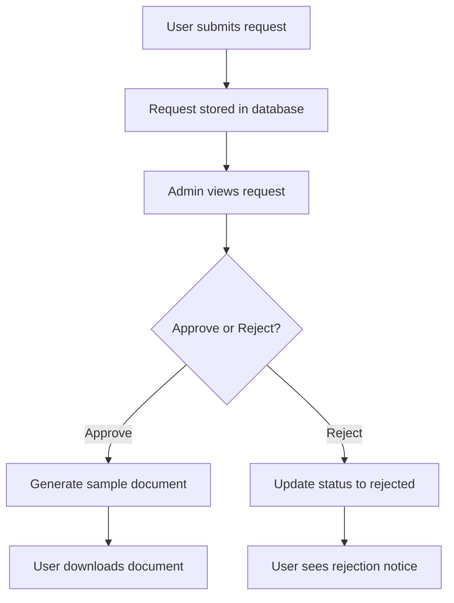

# 🔷 CivilDocs - Online Civil Status Document System

[](https://reactjs.org/)
[](https://www.php.net/)

## 📜 Overview

CivilDocs is a prototype website demonstrating how citizens could request civil status documents online. This project is a simple frontend implementation with basic PHP for testing purposes.

### Document Types
- Birth certificates
- Marriage certificates
- Death certificates

## 🎯 Project Goals

- Demonstrate a user interface for remote document requests
- Showcase a simplified administrative workflow
- Provide a prototype for potential future implementation

## 🖥️ Technical Details

### Technology Stack
- **Frontend**: 
  - React.js with basic components
  - Styled-components for UI styling
  - Simple form handling

- **Backend**:
  - Basic PHP for testing and demonstration
  - Simple SQL database for storing requests

*Note: This is a demonstration project and does not implement production-level security features, API integrations, or robust backend processing.*

## 🔍 Features

### User Features
- Submit document requests through a simple form
- Specify document type and basic information
- View simulated request status

### Admin Features
- Basic interface to view submitted requests
- Simple approve/reject functionality
- Document generation simulation

## 🚀 Installation

### Prerequisites
- Node.js (v14+)
- PHP (for testing)
- Basic SQL database

### Setup
```bash
# Clone the repository
git clone https://github.com/your-username/civildocs.git

# Navigate to project directory
cd civildocs

# Install dependencies
npm install

# Start React development server
npm start

# In a separate terminal, start PHP test server
php -S localhost:8000 -t backend/
```

## 📋 Project Structure

```
civildocs/
├── public/
├── src/
│   ├── components/
│   │   ├── DocumentForm/
│   │   ├── AdminPanel/
│   │   └── StatusViewer/
│   ├── pages/
│   │   ├── Home.js
│   │   ├── Request.js
│   │   └── Admin.js
│   ├── App.js
│   └── index.js
├── backend/
│   ├── process_request.php
│   ├── get_status.php
│   └── admin_actions.php
└── package.json
```

## 💡 Use Cases

1. **Submit a request**:
   - User fills out a form with information such as document type and reference number

2. **Process a request** (demonstration only):
   - Admin can view and process incoming requests through a simple interface

3. **Download document** (simulated):
   - User can view the status and download a sample document when approved

## 🔄 Workflow



## 🔮 Future Development Ideas

- Implement actual document generation
- Add proper authentication and security
- Develop API integrations with government systems
- Build mobile-responsive interface improvements

## 📄 License

This project is available as open source under the terms of the MIT License.
